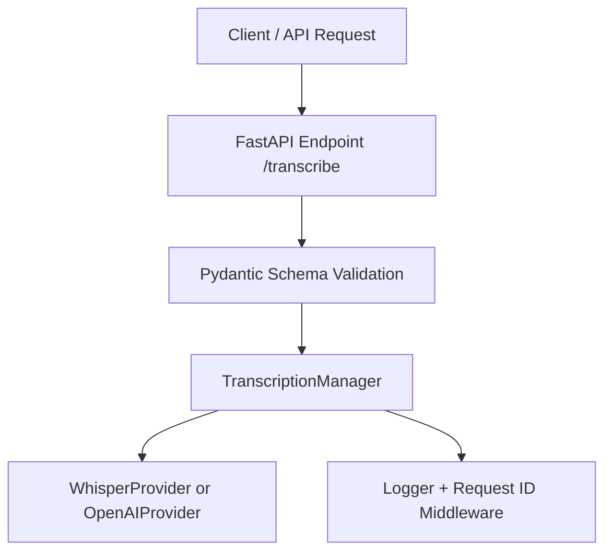

# 📁 Project Structure: Transcription Backend

This FastAPI backend is designed for extensible audio transcription using pluggable providers (e.g. Whisper, online APIs). It follows a clean layered architecture with centralized logging and optional request tracing.

---

## 🧱 Folder Tree

```bash
transcription_api/
│
├── docs/                              # 📘 Project documentation
│   ├── architecture.md                # Project structure, layers, logging
│   ├── api.md                         # API spec / flowcharts
│   └── postman_collection.json        # Manual testing collection 
│
├── app/                               # Main application package
│   ├── main.py                        # FastAPI app entry point
│
│   ├── api/                           # API route definitions
│   │   └── v1/
│   │       ├── transcribe.py          # /transcribe endpoint
│   │       └── system.py              # /health or /ping route
│
│   ├── schemas/                       # Pydantic request/response models
│
│   ├── services/                      # Core business logic
│   │   ├── transcriber.py             # TranscriptionManager
│   │   └── providers/                 # Modular provider implementations
│   │       ├── base.py                # Abstract base class
│   │       ├── whisper_local.py       # Offline Whisper implementation
│   │       └── open_ai.py             # Online API provider (e.g., OpenAI)
│
│   ├── core/                          # Core utilities
│   │   ├── config.py                  # Environment/config using pydantic.BaseSettings
│   │   └── logger.py                  # Central logger (with rotation)
│
│   ├── middleware/                    # Custom middlewares
│   │   └── request_id.py              # Request ID middleware for traceable logs
│
│   └── utils.py                       # Shared helper functions
│
├── tests/                             # Unit and integration tests
│   ├── test_transcribe.py             # Test for /transcribe endpoint
│   └── test_whisper.py                # Unit test for Whisper provider
│
├── logs/                              # Log file directory
│   └── app.log                        # Rotating daily log file
│
├── .env                               # Environment variables (API keys, config)
├── requirements.txt                   # Python dependencies
├── Dockerfile                         # Optional: containerized deployment
└── README.md                          # Project overview and quickstart
```

---

## 🧩 Layer Descriptions

```bash
API Layer
  - Path: app/api/v1/
  - Purpose: Exposes HTTP routes like /transcribe and /health

Schemas Layer
  - Path: app/schemas/
  - Purpose: Pydantic models for validating input and formatting output

Services Layer
  - Path: app/services/
  - Purpose: Core logic; the TranscriptionManager orchestrates providers

Providers Layer
  - Path: app/services/providers/
  - Purpose: Implements specific transcription engines (e.g., Whisper, OpenAI)

Core Layer
  - Path: app/core/
  - Purpose: Configuration and logging tools, loaded from .env

Middleware Layer
  - Path: app/middleware/
  - Purpose: Middleware for request tracing, like adding request IDs

Utils Layer
  - Path: app/utils.py
  - Purpose: Shared helper functions used across multiple modules

Tests Layer
  - Path: tests/
  - Purpose: Contains unit and integration test cases

Logs Layer
  - Path: logs/
  - Purpose: Stores output logs (daily-rotated log files)

Docs Layer
  - Path: docs/
  - Purpose: Human-readable and tool-based documentation (e.g., API spec, Postman)
```

---

## 🧠 System Flow Diagram (Layers)


## 📌 Notes
- New transcription providers can be added by extending BaseProvider and registering them in TranscriptionManager.
- Logging is centralized in logger.py and supports file rotation under the logs/ directory.
- Environment configuration is managed via config.py using pydantic.BaseSettings.
- Each request is tagged with a unique ID using RequestIDMiddleware, improving traceability in logs.